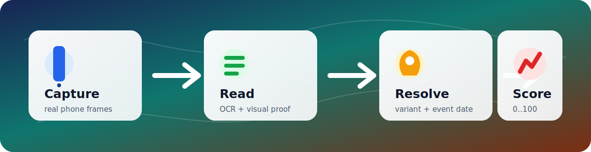
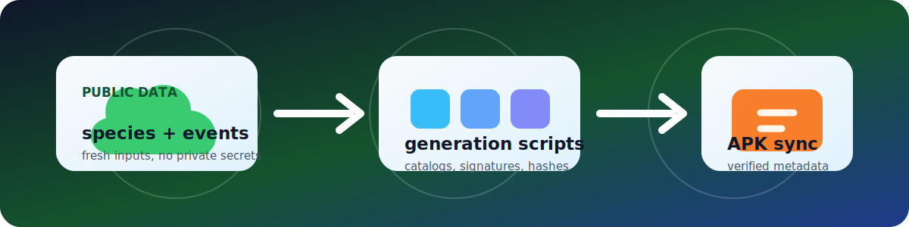
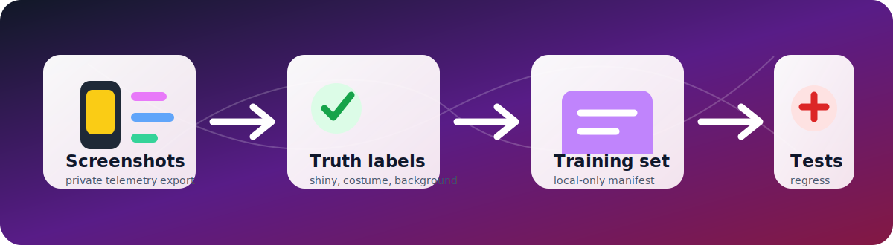

// Purpose: Present PokeRarityScanner on GitHub without exposing private telemetry or local project notes.
= PokeRarityScanner
:toc: macro
:toclevels: 2
:icons: font
:source-highlighter: rouge

++++

  
  
  
  

 

  
   
  <strong>Evidence-based rarity scanning for Pokemon GO collection cards.</strong>

++++

[.lead]
PokeRarityScanner is an Android scanner for Pokemon GO collection screens. It reads the live device screen, combines OCR with visual evidence, resolves costume and event context, and returns a capped rarity score with a human-readable explanation.

toc::[]

== At A Glance

[source,text]
----
Pokemon GO card frame
        |
        v
OCR + visual evidence
        |
        v
Variant and event resolver
        |
        v
Rarity score, tier, explanation, optional private telemetry
----

== Why It Exists

Pokemon GO collection value is not just CP or shiny state. Costumes return across different years, the same visual costume can map to multiple events, and OCR is noisy on real phones. The app treats rarity as an evidence problem instead of a single lookup.

[cols="1,2,2",options="header"]
|===
| Signal
| Used For
| Guard

| OCR text
| Species, CP, HP, caught date
| Species refinement, CP validation, consistency gates

| Visual signatures
| Shiny, costume, shadow, background, special form
| Confidence thresholds plus same-species fallback logic

| Historical event windows
| Correct event labels
| Event names are shown only when caught date fits the window

| Living metadata
| Fresh variant and catalog data
| Hash-checked generated manifests

| Private telemetry
| Debugging real scans from test devices
| Upload IDs link phone logs to server records
|===

== Visual Pipeline

[source,text]
----
ScreenCaptureService
  -> OCRProcessor
       -> TextParser
       -> SpeciesRefiner
       -> ScanConsistencyGate
  -> VisualFeatureDetector
       -> ShinySignatureStore
       -> CostumeSignatureStore
       -> VariantPrototypeClassifier
       -> VariantDecisionEngine
       -> FullVariantMatcher
  -> RarityCalculator
  -> Overlay UI
  -> optional telemetry queue
----

== Rarity Model

The scoring model is capped and additive. It replaced the older multiplier-heavy approach because multipliers made weak evidence look rarer than it should.

[source,text]
----
totalScore =
  baseSpeciesAxis  0..35
+ variantAxis      0..35
+ ageAxis          0..20
+ collectorAxis    0..10

totalScore is clamped to 0..100.
----

[cols="1,1,3",options="header"]
|===
| Axis
| Range
| Evidence

| Base species
| 0..35
| Normalized species rarity from generated metadata

| Variant
| 0..35
| Shiny, costume, shadow, lucky, form, background, and combo signals

| Age
| 0..20
| Older caught-date tiers

| Collector
| 0..10
| Size, rare gender, and date-backed event context
|===

++++

  <table>
    <tr>
      <td align="center"><strong>Common</strong> <code>0+</code></td>
      <td align="center"><strong>Uncommon</strong> <code>20+</code></td>
      <td align="center"><strong>Rare</strong> <code>40+</code></td>
      <td align="center"><strong>Epic</strong> <code>60+</code></td>
      <td align="center"><strong>Legendary</strong> <code>75+</code></td>
      <td align="center"><strong>Mythical</strong> <code>88+</code></td>
      <td align="center"><strong>God Tier</strong> <code>96+</code></td>
    </tr>
  </table>

++++

== Costume And Event Resolution

The app can detect that a Pokemon is costumed without claiming the wrong event. Event names are exposed only when the captured date supports the event window.

[source,text]
----
visual costume/form key
        |
        v
authoritative variant entry
        |
        v
historical event candidates
        |
        v
caught date inside exact event window?
        |
        +-- yes -> named event label + event scoring evidence
        +-- no  -> generic costume/form label, no named event bonus
----

This prevents a Pokemon caught in 2018 from being scored as a later repeated-costume event just because the sprite looks similar.

== Living Metadata

Living metadata lets the app refresh generated Pokemon data without requiring a full APK release every time external data changes.

[cols="1,2",options="header"]
|===
| Stage
| Output

| Download current public Pokemon data
| Temporary workflow input

| Generate variant and catalog data
| `variant_catalog.json`, `authoritative_variant_db.json`

| Generate visual signatures
| `costume_signatures.json`, `shiny_signatures.json`

| Update manifest hashes
| `metadata_manifest.json`

| App sync
| Hash-checked local metadata cache
|===

== Private Telemetry

Telemetry exists for test builds distributed to more than one phone. Real screenshots can be used to debug recognition, compare device logs, and build future training datasets.

[source,text]
----
phone logcat:
  upload_id + local decision + screenshot state

private telemetry export:
  upload_id + uploaded payload + optional screenshot path

comparison key:
  upload_id
  device model
  upload timestamp
----

No telemetry endpoint, API key, personal email, release password, local signing path, or private handover note belongs in this repository.

== Project Layout

[source,text]
----
app/src/main/java/com/pokerarity/scanner/
  data/
    local/       Room, SQLCipher, encrypted preferences
    remote/      telemetry uploader and endpoint helpers
    repository/  rarity, metadata, event, Pokemon repositories
    model/       scan, rarity, variant, telemetry DTOs
  service/       capture, scan orchestration, overlay lifecycle
  ui/            Compose screens, overlay card, history surfaces
  util/
    ocr/         ML Kit OCR and parsing helpers
    vision/      signatures and variant matching

app/src/main/assets/data/  generated metadata consumed by the APK
app/src/test/              focused JVM regression tests
scripts/                   metadata generation and release utilities
----

== Build

[source,powershell]
----
.\gradlew.bat :app:testDebugUnitTest --no-daemon --console=plain
.\gradlew.bat :app:assembleDebug --no-daemon --console=plain
----

Debug APK output:

[source,text]
----
app/build/outputs/apk/debug/PokeRarityScanner-v<version>-debug.apk
----

Release APK output:

[source,text]
----
app/build/outputs/apk/release/PokeRarityScanner-v<version>.apk
----

== Repository Hygiene

[cols="1,2",options="header"]
|===
| Stored In Repo
| Kept Local Only

| Kotlin source, tests, scripts
| `local.properties`

| Generated public metadata
| API keys and release signing passwords

| GitHub Actions workflows
| Agent handover notes and private markdown docs

| Placeholder config examples
| Personal domains, private telemetry URLs, local paths
|===

== Current Development Focus

[source,text]
----
[done] capped rarity scoring model
[done] date-gated event naming
[done] living metadata workflow without repository submodules
[done] private telemetry for real-device scan debugging
[now ] use real scan screenshots to harden shiny/costume/background recognition
[next] convert verified telemetry rows into labeled regression/training fixtures
----
