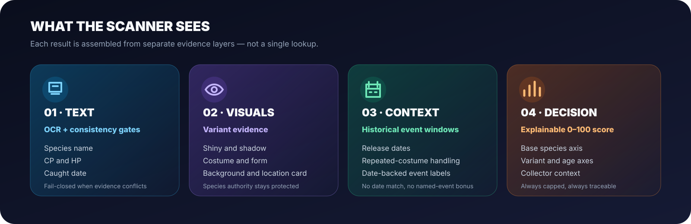
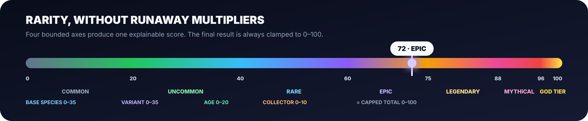
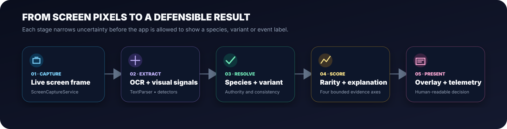
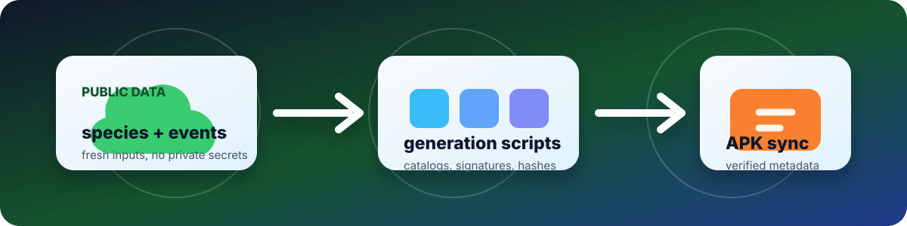

// Purpose: Present PokeRarityScanner as a visual, trustworthy Android product page without exposing private telemetry or local-only project data.
= PokeRarityScanner
:toc: macro
:toclevels: 2
:icons: font
:source-highlighter: rouge

++++

  
    
  <strong>Evidence-based rarity scanning for Pokémon GO collection screens.</strong>
   
  On-device OCR, visual variant evidence, historical event context and an explainable 0–100 score.
    
  
  
  

++++

++++

  
  
  
  
  
  

++++

++++

  
  
  
  
  
  

++++

[NOTE]
====
PokeRarityScanner is a fan-made research and development project. It is not affiliated with, endorsed by or sponsored by Niantic, Nintendo, Creatures Inc. or GAME FREAK.
====

toc::[]

== The 10-second version

PokeRarityScanner watches a live Pokémon GO detail screen on a real Android device. It extracts text, evaluates visual variant evidence, checks historical event windows and produces a bounded rarity decision that explains _why_ the result received its score.

[cols="1,1,1,1",options="header"]
|===
| Read
| See
| Verify
| Explain

| Species, CP, HP and caught date
| Shiny, shadow, costume, form and special backgrounds
| Species consistency and date-backed event context
| Rarity tier, score components and evidence labels
|===

== What the scanner sees

The scanner deliberately separates species authority from variant evidence. A visual classifier may strengthen a costume or form decision, but it is not allowed to silently replace a strongly established species identity.

== A rarity score you can inspect

[source,text]
----
totalScore =
  baseSpeciesAxis  0..35
+ variantAxis      0..35
+ ageAxis          0..20
+ collectorAxis    0..10

final score = clamp(totalScore, 0, 100)
----

The additive model replaced multiplier-heavy scoring. Weak evidence can no longer inflate the result beyond the contribution allowed for its axis.

[cols="1,1,3",options="header"]
|===
| Axis
| Range
| Evidence

| Base species
| 0..35
| Generated species rarity metadata

| Variant
| 0..35
| Shiny, costume, shadow, lucky, form, background and supported combinations

| Age
| 0..20
| Caught-date age tiers

| Collector
| 0..10
| Size, rare gender and date-backed event context
|===

== Why event dates matter

A costume can return in several years. A matching sprite alone is therefore not enough to claim a named event.

[cols="1,2,2",options="header"]
|===
| Evidence
| Result label
| Scoring effect

| Costume detected + caught date inside an authoritative event window
| Named event and release window may be shown
| Event-backed evidence may contribute

| Costume detected + no matching caught-date window
| Generic costume or form label only
| Costume evidence remains; named-event bonus is suppressed
|===

This prevents a Pokémon caught in an earlier year from being presented as a later repeated-costume event merely because the visual asset looks similar.

== Decision pipeline

[source,text]
----
ScreenCaptureService
  -> OCRProcessor + TextParser
  -> SpeciesRefiner + consistency gates
  -> VisualFeatureDetector + variant decision
  -> Historical event resolver
  -> RarityCalculator
  -> Overlay UI
  -> optional consent-gated private telemetry
----

== Recognition quality gates

The repository includes deterministic characterization data and fixture-integrity checks so recognition changes are measured instead of judged only by appearance.

++++

  <table>
    <tr>
      <td align="center"><strong>1,011</strong> canonical species in the characterization corpus</td>
      <td align="center"><strong>44</strong> recorded scan fixture entries</td>
      <td align="center"><strong>0</strong> corrupt or missing fixture files</td>
      <td align="center"><strong>Fail closed</strong> when species evidence is unsafe</td>
    </tr>
  </table>

++++

Important distinction: the generated OCR mutation corpus characterizes parser behavior; it is not presented as a substitute for a full camera-image benchmark. Real-device scans remain the ground truth needed to harden costume, shiny and background recognition.

== Living metadata

The app can refresh generated Pokémon metadata without requiring a new APK for every catalog change.

[cols="1,2",options="header"]
|===
| Stage
| Output

| Retrieve current public Pokémon data
| Temporary workflow input

| Generate catalog and variant data
| `variant_catalog.json`, `authoritative_variant_db.json`

| Generate visual signatures
| Costume and shiny signature assets

| Update integrity manifest
| Version and SHA-256 values in `metadata_manifest.json`

| App sync
| Verified local metadata cache
|===

== Technology

[cols="1,2",options="header"]
|===
| Area
| Components

| Android UI
| Kotlin, Jetpack Compose, overlay services

| Text recognition
| Google ML Kit OCR, parsing and species refinement

| Computer vision
| OpenCV, visual signatures and prototype classifiers

| Local data
| Room, SQLCipher and encrypted preferences

| Remote data
| Hash-verified living metadata and consent-gated test telemetry

| Quality
| JVM regression tests, fixture integrity tests, lint, detekt and security workflows
|===

== Build it

Requirements:

* Android Studio with JDK 17
* Android SDK 35
* A physical Android device for live screen-capture validation
* ADB for installation and diagnostics

[source,powershell]
----
git clone https://github.com/chaglaruk/PokemonRarityScanner.git
cd PokemonRarityScanner

.\gradlew.bat :app:testDebugUnitTest --no-daemon --console=plain
.\gradlew.bat :app:assembleDebug --no-daemon --console=plain
----

Debug APK:

[source,text]
----
app/build/outputs/apk/debug/PokeRarityScanner-v<version>-debug.apk
----

Install and launch:

[source,powershell]
----
adb install -r app\build\outputs\apk\debug\PokeRarityScanner-v<version>-debug.apk
adb shell monkey -p com.pokerarity.scanner -c android.intent.category.LAUNCHER 1
----

== Project map

[source,text]
----
app/src/main/java/com/pokerarity/scanner/
  data/
    local/       Room, SQLCipher, encrypted preferences
    remote/      telemetry transport
    repository/  rarity, event, metadata and Pokémon repositories
    model/       scan, rarity, variant and telemetry models
  service/       capture, scan orchestration and overlay lifecycle
  ui/            Compose screens, history and result surfaces
  util/
    ocr/         ML Kit OCR and parsing
    vision/      signatures, classification and variant matching

app/src/main/assets/data/  generated metadata consumed by the APK
app/src/test/              regression and characterization tests
docs/                      design records and implementation history
scripts/                   metadata, validation and release utilities
----

== Current development focus

[cols="1,4",options="header"]
|===
| State
| Work

| ✓
| Capped four-axis rarity model

| ✓
| Date-gated named-event attribution

| ✓
| Living metadata workflow with integrity checks

| ✓
| Real-device telemetry and fixture import tooling

| Now
| Harden shiny, costume, form and background recognition with verified real scans

| Next
| Convert verified telemetry rows into labeled regression and training fixtures
|===

== Repository safety

Secrets, signing material, local machine paths and private telemetry endpoints must never be committed. `local.properties` remains local and only placeholder configuration belongs in the repository.

== Credits and trademark notice

The small Pokémon sprites displayed above are served from the link:https://github.com/PokeAPI/sprites[PokéAPI sprites repository]. Pokémon and Pokémon character names are trademarks of their respective owners. Their inclusion identifies the fan-project domain and does not imply endorsement.
