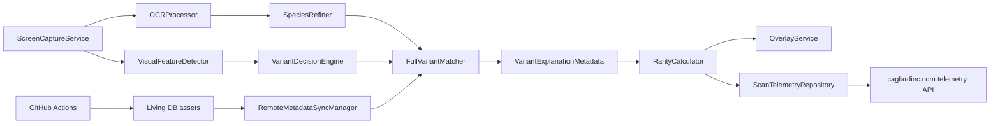

<!-- Amac: GitHub ana sayfasinda PokeRarityScanner'i etkileyici, okunabilir ve teknik olarak dogru tanitmak. -->

<div align="center">

# PokeRarityScanner

Gercek cihaz uzerinde Pokemon GO kartlarini okuyan, kostum/event baglamini cozen
ve nadirlik skorunu kanita dayali hesaplayan Android scanner.


```text
                         PokeRarityScanner
  -----------------------------------------------------------------
  Pokemon GO screen  ->  OCR + visual signals  ->  rarity decision
  screenshot frame       name / CP / HP            score + overlay
                         shiny / costume           telemetry upload
                         caught date               living metadata
  -----------------------------------------------------------------

      [Bulbasaur] [CP 619] [HP 84] [caught: 2018-10-23]
              | costume detected
              | event label only if date window matches
              v
      score: 42 / 100     tier: Rare     confidence: date-backed
```

</div>

## Neden Var?

Pokemon GO'da koleksiyon degeri yalnizca CP veya shiny bilgisinden ibaret degil.
Ayni kostum farkli yillarda tekrar yayinlanabiliyor, bazen ayni sprite farkli
Event Pokedex kayitlarina denk gelebiliyor. Bu uygulama bu karisikligi tek bir
scan pipeline'inda toparlar:

| Sinyal | Ne Icin Kullanilir |
| --- | --- |
| OCR adi, CP, HP, tarih | Pokemon kimligi, guven skoru, tarih filtresi |
| Shiny, shadow, lucky, costume, form | Varyant ekseni ve kombine nadirlik |
| Authoritative variant DB | Sprite/form/kostum adaylari |
| Historical event windows | Yanlis yil/event eslesmesini engelleme |
| Telemetry upload | Baska cihazlardan gelen hatali scanleri yakalama |
| Living DB | APK guncellemeden metadata yenileme |

## Sistem Haritasi



## Rarity Skoru

Eski modelde shiny/lucky gibi sinyaller carpan olarak uygulaniyordu. Bu, dusuk
kanitli scanlerde puani gereksiz sisiriyordu. Yeni model 0-100 arasi dort
tavanli eksenden olusur:

```text
totalScore =
  baseSpeciesAxis  0..35
+ variantAxis      0..35
+ ageAxis          0..20
+ collectorAxis    0..10

totalScore is always capped to 0..100
```

| Eksen | Kaynak | Not |
| --- | --- | --- |
| Base species | `rarity_manifest.json` | Common -> legendary/mythical arasi normalize edilir |
| Variant | `rarity_rules.json` | Shiny, costume, shadow, lucky, location card ve kombolar |
| Age | caught date | 1+, 3+, 5+, 7+ yil tierleri |
| Collector | size, rare gender, event weight | Event puani sadece yakalanma tarihiyle dogrulanir |

Event adi skor ve aciklamaya yalnizca tarih penceresi uyuyorsa girer. Ornek:
2018'de yakalanmis bir kostumlu Pokemon, ayni kostum 2023'te tekrar geldigi
icin 2023 eventine baglanmaz; event etiketi bastirilir, kostum puani ise korunur.

Tier esikleri:

| Tier | Min skor |
| --- | ---: |
| Common | 0 |
| Uncommon | 20 |
| Rare | 40 |
| Epic | 60 |
| Legendary | 75 |
| Mythical | 88 |
| God Tier | 96 |

## Costume ve Event Karari

Uygulama event adini yazmadan once su kapilardan gecirir:

```text
final sprite key
  -> authoritative variant entry
  -> historical event windows
  -> caught date inside exact window?
      yes: expose event label + release window
      no : expose only generic costume/form label
```

Bu kural ayni kostumun farkli yillarda tekrarlandigi durumlarda yanlis
"2030/2023 event" baglamini engeller. Skor sistemi de ayni mantigi kullanir:
tarih destekli event yoksa named event bonusu yoktur.

## Telemetry

Test APK'sini baska telefonlar yuklediginde scan verileri otomatik olarak
sunucuya gider. Ama amac sadece veri toplamak degil; yerel ADB loglari ile
server export'unu ayni `upload_id` uzerinden karsilastirabilmektir.

```text
POST /scan-telemetry/api/scan-upload.php
POST /scan-telemetry/api/scan-feedback.php
GET  /scan-telemetry/api/scan-export.php
```

Uploader screenshot varsa multipart olarak gonderir. Screenshot cache'te yoksa
metadata-only upload'a duser; bu sayede scan kaydi kaybolmaz.

## Living DB

Living DB, rarity ve variant metadata'sini APK disindan yenilemek icin var.
GitHub Actions workflow'u PokeMiners submodule kaynaklarini kullanir, assetleri
uretildikten sonra `metadata_manifest.json` icindeki `version` ve `sha256`
degerlerini gunceller.

```text
external/game_masters  -> PokeMiners Game Master data
external/pogo_assets   -> sprite and asset references
scripts/               -> metadata generation tools
app/src/main/assets/data/
```

Uygulama acilista manifesti dogrular, hash kontrolu yapar ve uygun dosyalari
lokal cache'e alir.

## Proje Yapisi

```text
app/src/main/java/com/pokerarity/scanner/
  data/
    local/       Room, SQLCipher, preferences
    remote/      telemetry HTTP client
    repository/  rarity, metadata, event and Pokemon repositories
    model/       scan, rarity, variant and telemetry DTOs
  service/       capture, scan orchestration, overlay lifecycle
  ui/            Compose screens, overlay card, history surfaces
  util/
    ocr/         ML Kit OCR and parsing helpers
    vision/      OpenCV, signatures, variant matching

app/src/main/assets/data/  generated metadata
app/src/test/              focused unit tests
scripts/                   metadata and release utilities
docs/                      design notes and implementation history
```

## Build ve Test

```powershell
.\gradlew.bat :app:testDebugUnitTest --no-daemon --console=plain
.\gradlew.bat :app:assembleDebug --no-daemon --console=plain
```

Debug APK:

```text
app/build/outputs/apk/debug/PokeRarityScanner-v<version>-debug.apk
```

ADB ile yukleme:

```powershell
adb devices
adb install -r app\build\outputs\apk\debug\PokeRarityScanner-v<version>-debug.apk
adb shell monkey -p com.pokerarity.scanner -c android.intent.category.LAUNCHER 1
```

## Debug Rutini

Scan bittiginde iki kaynak birlikte okunur:

```powershell
adb logcat -d --pid $(adb shell pidof com.pokerarity.scanner) -v time -t 300
```

```text
https://caglardinc.com/scan-telemetry/api/scan-export.php?api_key=<secret>&limit=25
```

Karsilastirma anahtarlari:

```text
upload_id
device_manufacturer + device_model + device_sdk_int
created_at / uploadedAtEpochMs
screenshot_relative_path
```

## Teknik Dayanak

- Pokemon GO Hub CP dokumantasyonu CP'nin base stats, IV ve level CPM ile
  hesaplandigini aciklar; bu uygulama CP'yi rarity yerine scan guven/IV
  baglaminda ele alir.
- Bulbapedia ve Pokemon GO Wiki event/costume formlarinin event baglamli,
  sinirli sureli ve bazen ayni kostumle farkli kayitlar olabildigini belgeler.
- Niantic event duyurulari costumed Pokemon ve event shiny boost'larinin zaman
  penceresine bagli oldugunu gosterir.

## Not

`local.properties` release signing ve telemetry secret degerlerini icerir; repoya
commitlenmemelidir. Telemetry secretlari README veya loglarda acik yazilmaz.
